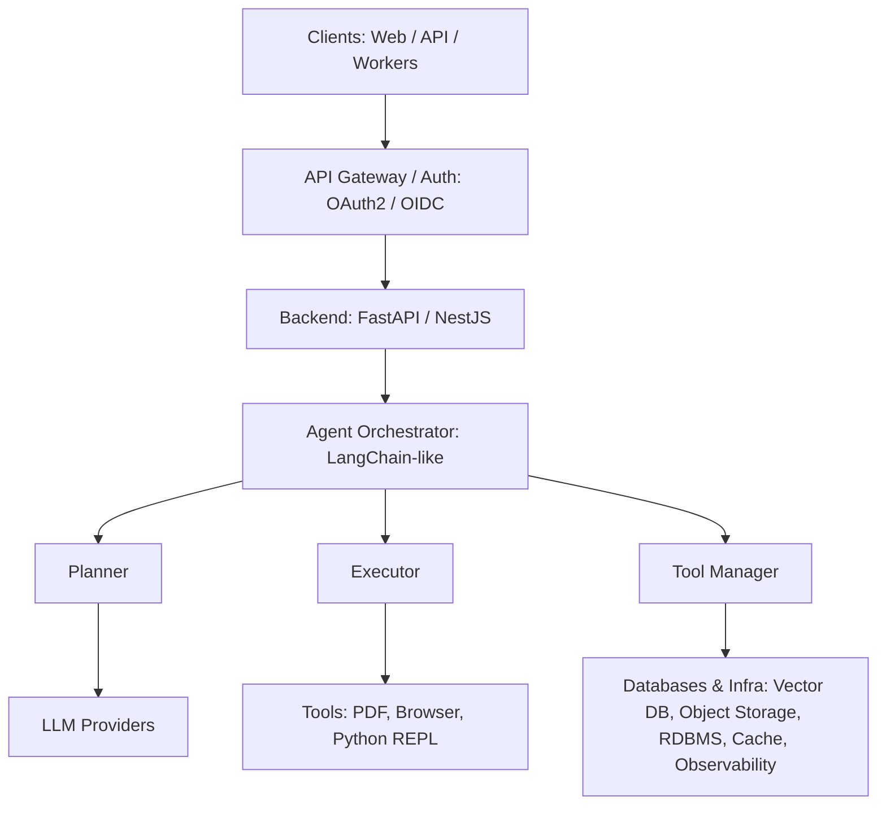

# Enterprise AI Agent System

**Professional README for GitHub**

## Overview

The **Enterprise AI Agent System** is a production-ready, modular AI platform designed to handle complex automation tasks using LLMs, tool integrations, and conversational memory. This repository serves as a blueprint for building enterprise-grade AI agents suitable for document analysis, automated workflows, semantic search, and multi-agent orchestration.

## Key Features

* Multi-agent orchestration (planner, executor, tool manager)
* Supports multiple LLM providers (Google Gemini, Anthropic, OpenAI, local models)
* Tool integrations: PDF reader, web search, Python execution, connectors for external systems
* Vector database for semantic search (Chroma, Milvus, or Pinecone)
* Conversational memory and multi-turn dialogue support
* Secure secrets management and authentication
* Observability, logging, and monitoring ready
* Designed for multi-tenant enterprise environments

## Architecture



*Diagram rendered using Mermaid syntax.*

## Tech Stack

* **Backend:** Python 3.11+, FastAPI
* **Agents:** LangChain or custom orchestrator
* **LLMs:** Google Gemini, Anthropic Claude, OpenAI
* **Vector DB:** Chroma, Milvus, Pinecone
* **Embeddings:** Google Embeddings / OpenAI / local
* **Frontend (demo):** Streamlit, Next.js
* **Auth:** OAuth2 / OIDC (Keycloak, Auth0), JWT
* **Database:** PostgreSQL
* **Storage:** S3-compatible (MinIO)
* **Queue/Cache:** Redis + Celery / RQ
* **CI/CD:** GitHub Actions, Terraform for infra
* **Monitoring:** Prometheus + Grafana, Sentry
* **Containerization:** Docker, Kubernetes (EKS/GKE/AKS)

## Folder Structure

```
enterprise-ai-agent/
├── .github/                 # CI/CD workflows & issue templates
├── infra/                   # Terraform & Kubernetes manifests
├── ops/                     # Deployment scripts & runbooks
├── services/
│   ├── api/                 # FastAPI backend
│   ├── orchestrator/        # Agent orchestrator
│   ├── workers/             # Async task workers
│   └── connectors/          # External system integrations
├── libs/                    # Shared libraries for agents and utilities
├── infra-configs/           # Config files for infrastructure
├── examples/                # Demo apps (Streamlit, Next.js)
├── scripts/                 # Development helpers
├── tests/                   # Unit, integration, and e2e tests
├── docs/                    # Documentation & architecture
├── .env.example             # Environment variable template
├── README.md                # Project overview (this file)
└── LICENSE                  # License
```

## Getting Started

1. Clone the repo

```bash
git clone git@github.com:sefineh-ai/enterprise-ai-agent.git
cd enterprise-ai-agent
```

2. Copy environment variables

```bash
cp .env.example .env
```

3. Install dependencies

```bash
pip install -r requirements.txt
```

4. Start backend (FastAPI)

```bash
uvicorn services.api.main:app --reload
```

5. Open API docs

```
http://localhost:8000/docs
```

## Contribution Guidelines

* Branching: `main` = protected, feature branches `feat/*`, bugfix `fix/*`
* Commit messages: semantic style (feat, fix, docs, chore)
* Pull Requests: must pass tests, review by 1+ team member
* Testing: use pytest for all services

## License

This project is licensed under **Apache-2.0 License**. See LICENSE for details.

---
